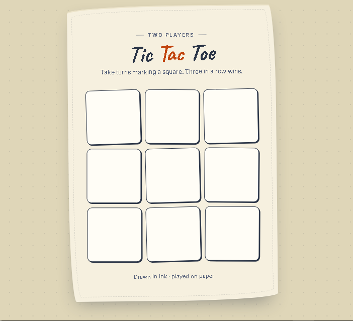

# 📝 Tic Tac Toe — Paper & Ink

A cozy, hand-drawn styled Tic Tac Toe game built with pure vanilla JavaScript and styled entirely with Tailwind CSS. No frameworks, no dependencies — just clean logic and a warm "paper & ink" aesthetic.

<p align="center">
  
  
  
</p>

<p align="center">
  <a href="https://arshiya7-dev.github.io/XO/">
    
  </a>
</p>

---

## ✦ Preview

<p align="center">
  
</p>

---

## ✨ Features

- 🎮 Classic two-player Tic Tac Toe, played locally on one screen
- 🖋️ Hand-drawn "notebook paper" visual theme with a custom stamp/pop animation for each move
- 🎲 Random starting player each round, announced through a custom modal (no native `alert()`)
- 🏆 Automatic win detection across all rows, columns, and diagonals
- 🔁 Auto-restart after a win, with a "Play again" option in the modal
- 📱 Fully responsive layout, playable on mobile and desktop alike

## 🛠️ Tech Stack

| Layer | Technology |
|---|---|
| Structure | HTML5 |
| Styling | Tailwind CSS (custom `@layer` utilities) |
| Logic | Vanilla JavaScript (ES6+) |
| Fonts | [Caveat](https://fonts.google.com/specimen/Caveat) & [Inter](https://fonts.google.com/specimen/Inter) via Google Fonts |

## 🎯 How to Play

1. The game randomly picks whether **X** or **O** goes first and shows it in a welcome modal.
2. Players take turns tapping empty squares to place their mark.
3. The first player to line up three marks — horizontally, vertically, or diagonally — wins.
4. A modal announces the winner and the board resets automatically for a new round.

## 🚀 Getting Started Locally

```bash
# Clone the repository
git clone https://github.com/arshiya7-dev/XO.git
cd XO

# Install Tailwind CSS (if building from source)
npm install

# Run Tailwind in watch mode
npx tailwindcss -i ./main.css -o ./dist/main.css --watch
```

Then simply open `index.html` in your browser.

## 📂 Project Structure

```
XO/
├── index.html          # Game markup
├── main.css            # Tailwind source styles
├── asset/
│   └── javascript/
│       └── script.js   # Game logic
└── README.md
```

## 📄 License

This project is open source and available for anyone to learn from, fork, and improve.

---

<p align="center">Drawn in ink · played on paper ✒️</p>

---

<div align="center">

Made with ❤️ by **[Arshiya](https://github.com/arshiya7-dev)**

⭐ Star this repo if you found it helpful!

</div>

